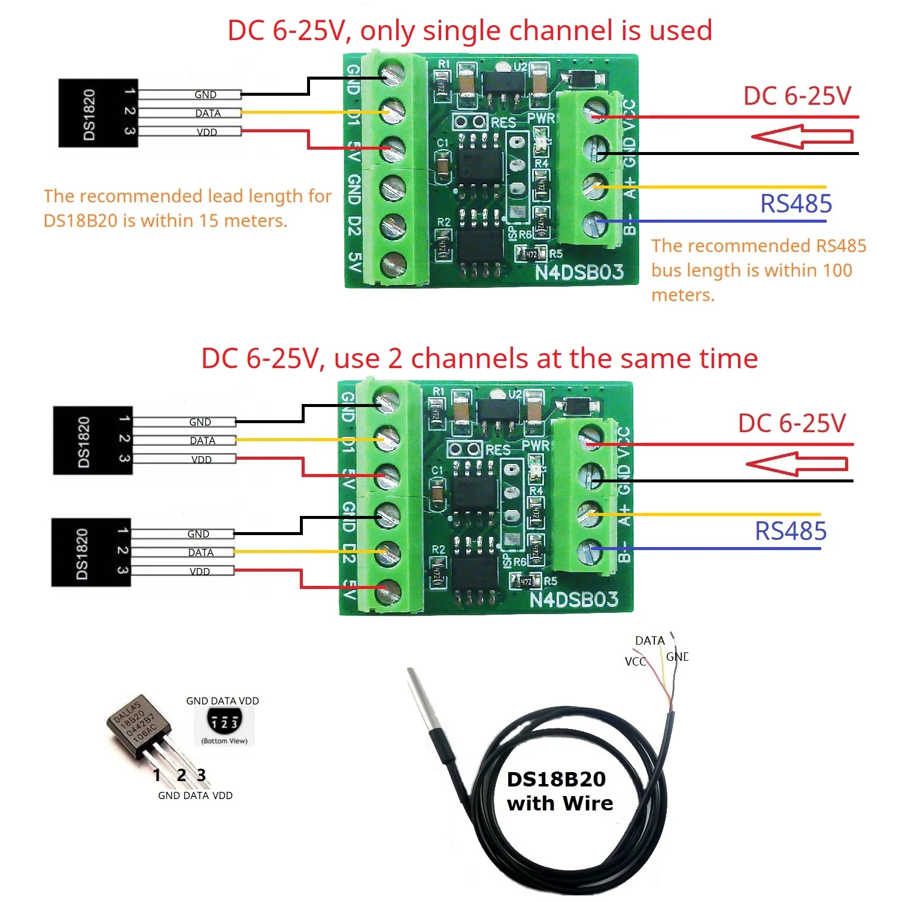

# N4DSB03: Quick How-To for Setting a New Device Address

## Purpose

This document shows a fast and safe way to change the RS485 address on a new N4DSB03.

## Verified Settings for This Model

- Model: N4DSB03
- Sensors: DS18B20 (D1/D2)
- Default serial: 9600, 8N1
- Address register: 253 (0x00FD)
- Address write is applied immediately (no power cycle required)

## Before You Start

- Keep only one new module on the bus while changing address. Best practice: connect that module directly to the USB-RS485 adapter during this step.
- Choose a free address in range 1..247.
- After write, the new address responds right away and the old one stops responding.

## Tools in This Repository

- `modbus_rtu_n4dsb03_scanner.py` - read/check response
- `modbus_rtu_write_register.py` - write register

## Quick Steps (RS485 adapter serial port, 9600)

Use `<COM_PORT>` as the serial port of your USB-RS485 adapter (the adapter connected to the module bus).



### 1) Check current address

```powershell
python modbus_rtu_n4dsb03_scanner.py --port <COM_PORT> --baudrate 9600 --parity N --bytesize 8 --stopbits 1 --scan-from 1 --scan-to 247 --start-addresses 253 --quantity 3 --functions 3 --timeout 0.2 --quick --dump
```

Expected: active slave plus values of 253/254/255.

### 2) Write new address (example: address 2)

```powershell
python modbus_rtu_write_register.py --port <COM_PORT> --baudrate 9600 --parity N --bytesize 8 --stopbits 1 --timeout 0.2 --slave 1 --address 253 --value 2
```

Where:
- `--slave 1` = current device address
- `--address 253` = address register
- `--value 2` = new address

### 3) Confirm new address is active

```powershell
python modbus_rtu_n4dsb03_scanner.py --port <COM_PORT> --baudrate 9600 --parity N --bytesize 8 --stopbits 1 --scan-from 2 --scan-to 2 --start-addresses 253 --quantity 3 --functions 3 --timeout 0.2 --dump
```

### 4) Confirm old address is inactive

```powershell
python modbus_rtu_n4dsb03_scanner.py --port <COM_PORT> --baudrate 9600 --parity N --bytesize 8 --stopbits 1 --scan-from 1 --scan-to 1 --start-addresses 253 --quantity 3 --functions 3 --timeout 0.2 --dump
```

Expected: `No Modbus RTU slaves found...` for old address.

## How to Roll Back Address

To restore previous address, write register 253 again using the current address.

Example rollback `2 -> 1`:

```powershell
python modbus_rtu_write_register.py --port <COM_PORT> --baudrate 9600 --parity N --bytesize 8 --stopbits 1 --timeout 0.2 --slave 2 --address 253 --value 1
```

## Read Sensor Registers (DS18B20)

Use `<SLAVE_ID>` as your active module address.

- FC04 register 0 = D1 temperature (raw int16, 0.1 C)
- FC04 register 1 = D2 temperature (raw int16, 0.1 C)

Conversion:
- `temp_c = int16(raw) / 10.0`

Read D1/D2 via FC04:

```powershell
python modbus_rtu_n4dsb03_scanner.py --port <COM_PORT> --baudrate 9600 --parity N --bytesize 8 --stopbits 1 --scan-from <SLAVE_ID> --scan-to <SLAVE_ID> --start-addresses 0 --quantity 2 --functions 4 --timeout 0.2 --dump
```

## Minimal Troubleshooting (No Response)

- Check that COM port exists in OS.
- Check selected port name of the USB-RS485 adapter (`<COM_PORT>` can change).
- Keep only one target device on the bus.
- Re-scan 1..247 with FC03, start address 253.

Note: All code in this repository was generated by AI
